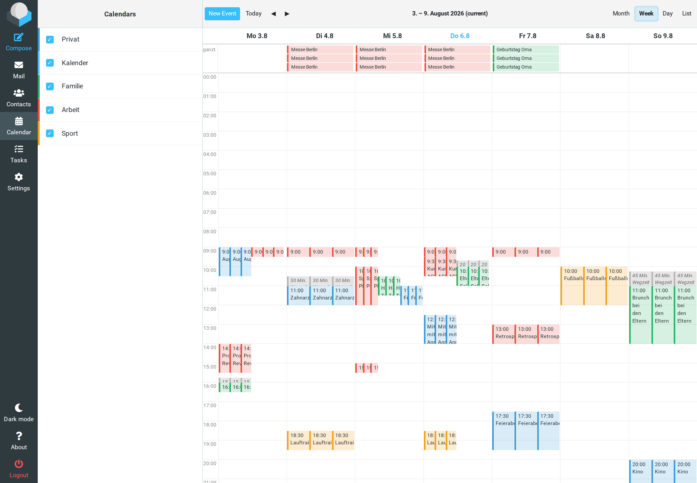
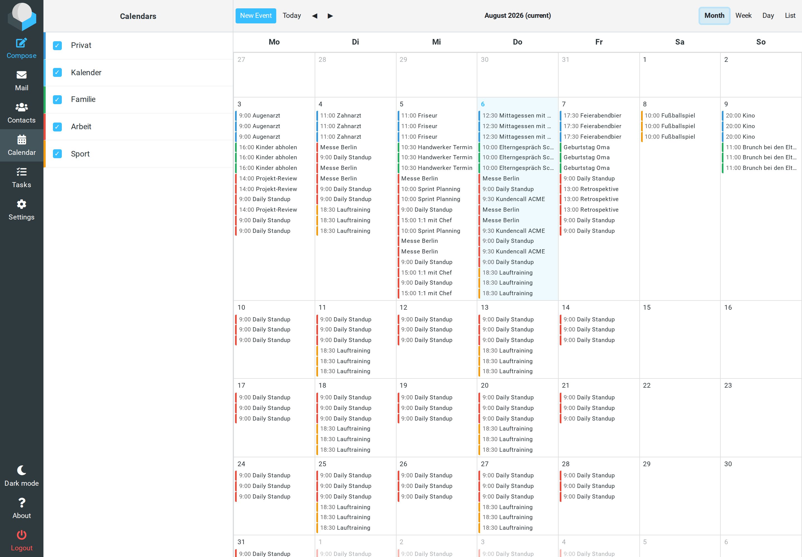
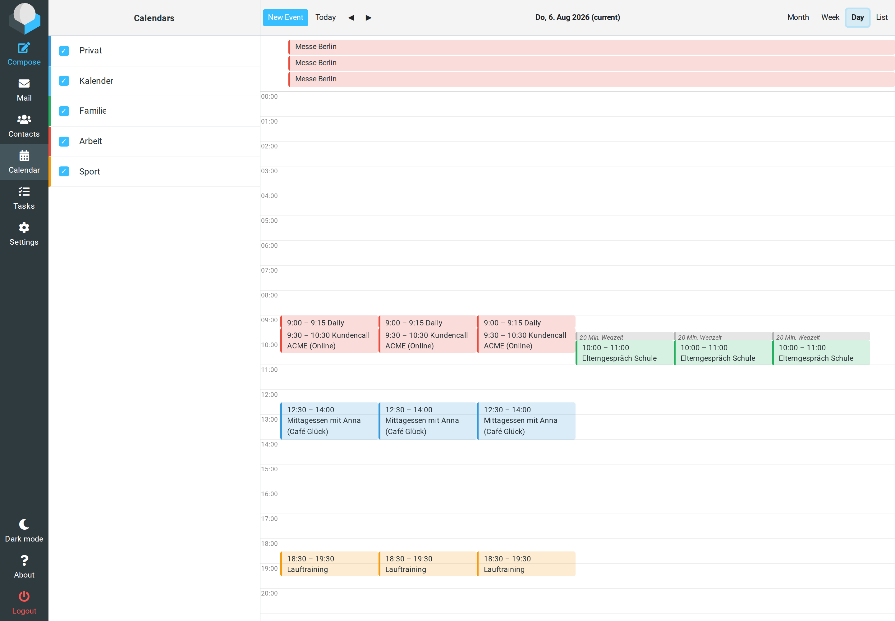
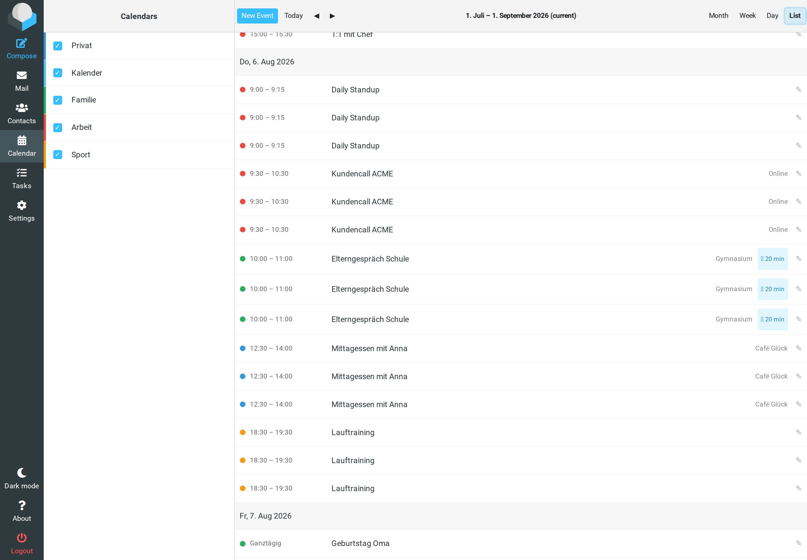
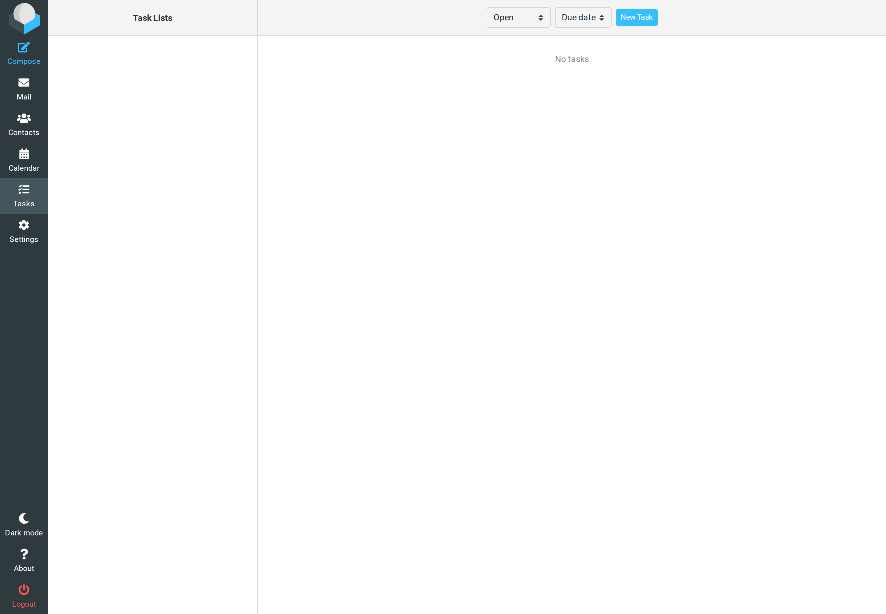
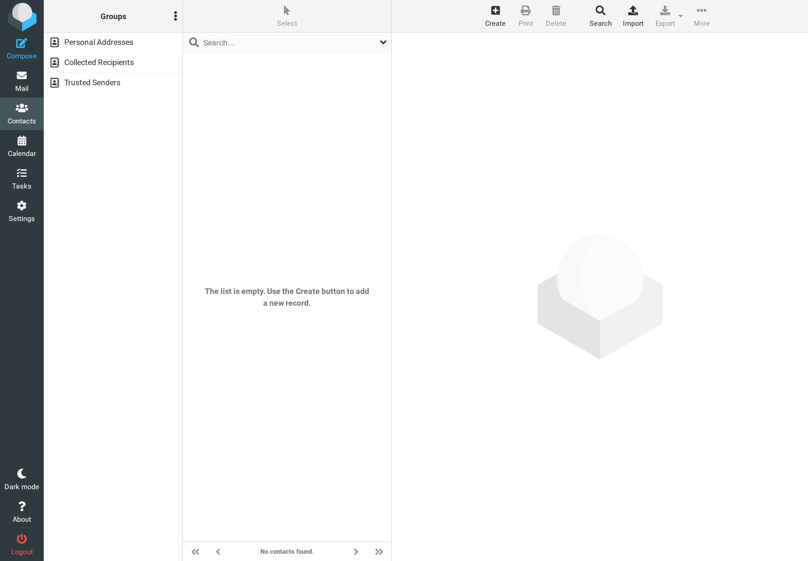

# roundcube_caldav_suite

CalDAV **Calendar, Tasks & Contacts** plugin for Roundcube Webmail.

Connects to **any CalDAV/CardDAV server** (Radicale, Baïkal, Nextcloud, iCloud, Google)
as a client. No Kolab, no heavyweight dependencies — just `sabre/dav` + `sabre/vobject`.

## Screenshots













## Features

- **Calendar** — Month/Week/Day/List views, multiple calendars with colors,
  create/edit/delete events, **recurrence (RRULE)**, reminders (VALARM), categories,
  all-day events, time zones (DST-correct), and Apple travel-time / structured location.
  The list view loads a large window and **loads more on scroll** (infinite scrolling),
  with day headers as navigable items.
- **Tasks** — VTODO lists with create/edit/complete/delete, priority, due & start dates,
  percent-complete, categories, recurrence. Per-task **due-date indicator** and
  **expandable details** (notes, location) on selection.
- **Contacts (CardDAV)** — integrates as a Roundcube address book: name parts, nickname,
  job title, organization & department, multiple emails/phones/addresses/URLs/IM with
  subtypes (home/work/cell/…), birthday, anniversary and notes.
  Contacts also appear in the **recipient autocomplete** when composing mail (the plugin
  registers its CardDAV sources into `autocomplete_addressbooks` at runtime).
- **Contacts (CardDAV)** — integrates as a Roundcube address book: name parts, nickname,
  job title, organization & department, multiple emails/phones/addresses/URLs/IM with
  subtypes (home/work/cell/…), birthday, anniversary and notes.
  Contacts also appear in the **recipient autocomplete** when composing mail (the plugin
  registers its CardDAV sources into `autocomplete_addressbooks` at runtime).
- **Meeting invitations (iMIP/iTIP)** — calendar invitations in mail show an
  Accept / Tentative / Decline box plus "propose new time" (COUNTER); accepting
  writes the event to your calendar and emails an iTIP reply to the organizer.
- **Auto-Discovery** — finds all calendars, task lists and address books from a single URL.
- **Non-destructive edits** — editing an object only touches the fields you changed;
  anything the form doesn't know (RRULE, ATTENDEE/ORGANIZER, EXDATE, custom `X-` props)
  is preserved instead of being dropped.
- **Accessible** — full keyboard navigation, screen-reader support, ARIA labels,
  semantic HTML; a fully accessible list/agenda view, **skip-to-calendar link**,
  **loading spinner with periodic screen-reader announcement**, and calendar/task
  lists that use Roundcube's native list semantics (select via click, edit via
  Enter / double-click / edit icon).
- **Location search** — geocoding via **Photon**, **Nominatim** or **Google Places**
  (new API) with optional browser-geolocation bias. Google runs through a server-side
  proxy so the API key never reaches the browser.
- **Persisted visibility** — which calendars and task lists are shown is remembered
  per user across sessions.
- **Lightweight** — only `sabre/dav` + `sabre/vobject`.

## Requirements

- PHP >= 8.1
- Roundcube >= 1.6
- A CalDAV/CardDAV server (Radicale, Baïkal, Nextcloud, …)

## Installation

```bash
cd /path/to/roundcube
composer require slohmaier/roundcube_caldav_suite
```

Add `caldav_suite` to `$config['plugins']` in your Roundcube config.

## Configuration

Go to **Settings → CalDAV Suite** in Roundcube and enter:

- CalDAV/CardDAV server URL (e.g. `https://radicale.example.com/user/`)
- Username & password

The plugin discovers all calendars, task lists and address books automatically.
(These settings are stored per Roundcube user, not in `config.inc.php`.)

**Location search** is configured under the same settings block:

- **Provider** — Photon (default, no key), Nominatim, or Google Places (New).
- **API key** — only required for Google Places. The key is stored per user and used
  server-side (a proxy endpoint calls the API), so it is never exposed to the browser.
  Restrict the key to your Roundcube domain in the Google Cloud console.

## Performance

To keep calendar loads fast, especially against single-threaded servers like Radicale:

- **Parallel event queries** — the plugin queries all calendars of a client
  concurrently with `curl_multi` instead of sequentially, so loading 2-4 calendars
  takes roughly the time of one request.
- **Parallel discovery** — when a server reports both `VEVENT` and `VTODO` for a
  calendar (e.g. Radicale reports `VEVENT,VTODO,VJOURNAL` for every calendar), the
  per-calendar content checks run in parallel instead of sequentially.
- **Session-cached discovery** — the calendar/task-list discovery runs once per
  session and is reused for later AJAX calls, so navigating between views does not
  re-scan the server every time.

This is transparent and requires no configuration. For very large calendars, a
multi-worker WSGI setup on the CalDAV server (e.g. gunicorn/uvicorn behind Radicale)
helps further with concurrent requests.

## Supported fields

**Events (VEVENT):** summary, start/end, all-day, time zone (DST-aware), location,
description, URL, status, transparency, class, **RRULE**, categories, VALARM reminder,
Apple travel time (`X-APPLE-TRAVEL-*`) and structured geo location.

**Tasks (VTODO):** summary, description, location, URL, due, start, priority,
percent-complete, status/completed, categories, RRULE.

**Contacts (vCard 3.0):** FN + structured N (last/first/middle/prefix/suffix), nickname,
job title, organization + department, email/phone/address/website/IM with subtypes,
birthday, anniversary, notes. Company contacts (empty `FN`) fall back to `ORG` for display.

Not exposed as form fields yet (but **preserved** across edits): `ATTENDEE`/`ORGANIZER`
(iTip invitations), per-instance recurrence exceptions (`EXDATE`/`RECURRENCE-ID`),
multiple alarms, contact photos.

## Development & Testing

Unit tests (no server needed):

```bash
composer install
php vendor/bin/phpunit --testsuite unit
```

A complete throwaway environment (Roundcube + Radicale + a dummy IMAP) lives in
[`test-stack/`](test-stack/) and mounts this repo directly as the plugin:

```bash
cd test-stack
docker compose up -d
./setup.sh                 # creates the test user, prefs and collections
# → http://127.0.0.1:8099  (login: test / test)
```

See [`test-stack/README.md`](test-stack/README.md) for details. After editing PHP code,
`docker compose restart rc-test-roundcube` (PHP OPcache).

## License

AGPL-3.0-or-later
